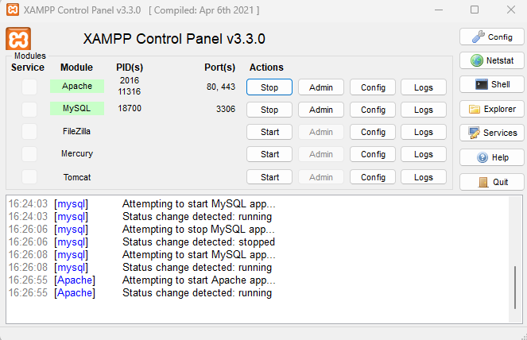
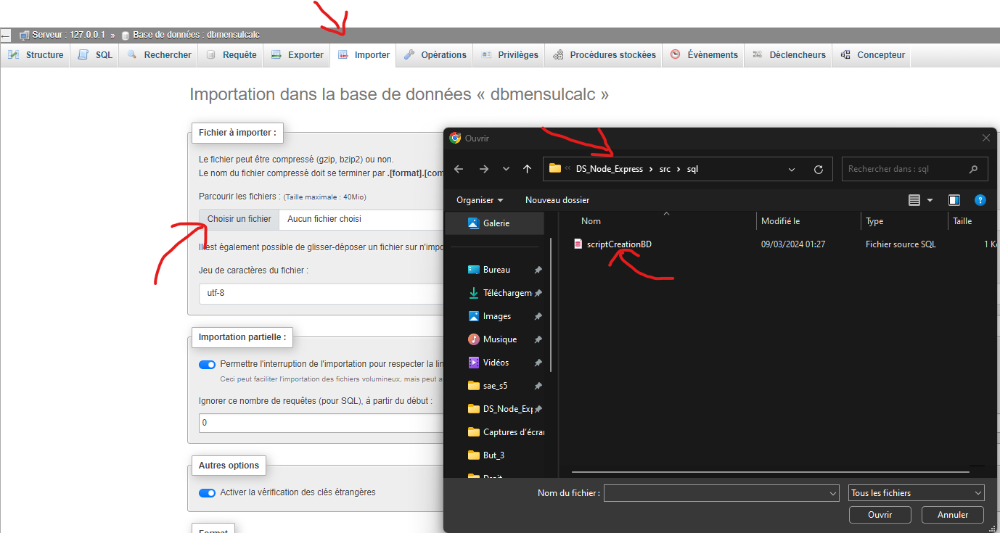

_Durand Antonin_ <br>
_Bui Brandon_ <br>
_Araujo Alexis_ <br>

<h1 style="color:#5d79e7; text-align: center"> Présentation de notre application</h1>

<h1 style="color:#5d79e7; text-align: center; margin-top: 100px"> Table des matières</h1>

<ol>
    <li> <a href="#introduction"> Introduction  </a> </li>
    <li> <a href="#installationApplication"> Installation de l'application </a> </li>
    <li> <a href="#explicationExtraitsCode"> Explication de deux extraits de code </a> </li>
    <ol>
        <li> <a href="#explication1"> Système de connexion dans l'application </a> </li>
        <li> <a href="#explication2"> Système de stockage des mensualités pour l'emprunt </a> </li>
    </ol>
</ol>

<h2 style="color:#5d79e7; page-break-before: always" id="introduction"> Introduction </h2>

Notre projet permet aux utilisateurs de calculer le montant des mensualités d'un emprunt selon trois caractéristiques saisies par l'utilisateur, le capital, le taux et le temps de l'emprunt.

Pour ce faire, ils devront se connecter, donnant accès à la page de calcul. Chaque nouveau calcul sera stocké temporairement, afin de leur laisser la possibilité de visaliser leurs anciens calculs via une autre page.

Ci-dessous sont présentées les différentes pages de l'application:

<h3> Page d'accueil </h3>

Page principale du site expliquant l'objectif de ce dernier, et affichant un message d'accueil personnalisé en fonction de l'utilisateur si connecté ou non.

<h3>Page de connection </h3>

Permet à l'utilisateur de se connecter pour accéder à la fonctionnalité du site, en entrant un login et un mot de passe. Des vérifications sont effectuées pour vérifier la validité des données.
Pour l'instant, un seul compte utilisateur est présent, dont les informations de connexions sont écrites en dur dans le code.

<h3>Page de calcul </h3>

Permet à l'utilisateur de calculer le montant des mensualités d'un emprunt en saisissant dans un formulaire, le montant de l'emprunt, la durée de l'emprunt et le taux d'intérêt. <br>
Une fois les données envoyées, nous vérifions le format des données où seul les nombres sont acceptés, si ces dernières sont conformes, l'utilisateur est renvoyé dans une page d'historique où sont affichés tout les résultats entrés par l'utilisateur. <br>
Dans le cas contraire, l'utilisateur reste sur la page de calcul avec un message d'erreur.

<h3>Page de déconnexion </h3>

Détruit la session de l'utilisateur et le redirige vers la page d'accueil.

<h2 style="color:#5d79e7; page-break-before: always" id="installationApplication"> Installation de l'application </h2>

<h3>Installation</h3>
<li>Package</li>
Pour installer tout les packages, il suffit de faire:

````bash
npm install
````
Cette commande permettra d'installer tout les packages se trouvant dans le fichier package.json.

<li>Base de données</li>
Pour réaliser une connexion et une inscription, il faut importer la table dans la base de données, sinon une erreur apparaitra (object : object).
<br> 
<ol>
<li>Première étape : lancer XAMPP control panel et start MYSQL ET APACHE</li>
    
<li>Deuxième étape : il faut se rendre sur l'url: localhost/phpmyadmin</li>
    Il faut aller sur importer -> chosir un fichier -> sélectionner la base de données dans DS_Node_Express/src/sql.
    <br> Vous vous retrouvez normalement avec une base de données, à gauche.
    <br> 
<li>Troisième étape (si erreur import de la table):</li>
    Il faut se rendre dans le code de la création de la base de données. Le copier !
    <br> 
    <br> Il faut se rendre sur la base de données -> Sélectionnez SQl. Coller !
    <br> 
</ol>

Et voilà ! Vous  pouvez maintenant lancer l'application et permettre de faire des inscriptions et des connexions.

<h3>Lancement de l'application</h3>
Une fois les différents packages installés et la base de données importé, l'application peut être lancée sur le port 8000 via la commande suivante:

````bash
npm start
````

<h3>Liste des packages</h3>

<li style="font-size:18px">path</li>
Permet de manipuler les chemins de fichiers et de répertoires:

````js
path.join(__dirname,"views","404.ejs")
````
__dirname : Répertoire du fichier
views : Un dossier <br>
404.ejs : Un fichier <br>
<br>
**Avantages:**
- Simplifie les redirections et la portabilité.
- Manipuler les chemins d'accès en sécurité et évite les injections.

<li style="font-size:18px">express</li>

Est un framework web qui permet de simplifier la gestion des routes, des requêtes, ... :

````js
const express = require('express'); // importe express
const app = express();  // variable d'utilisation
app.listen(port); // Port du lancement (localhost)
app.use(formEmpruntRoutes); //Ulilise les routes
````

**Avantages:** 
- Facilite l'utilisation.
- Offre une architecture simple.
- Il est flexible et peut être utilisé dans la plus part des applications web.
- Permet de haute performance.
- Peut être intégré avec d'autre technologies (ex : MongoDB).

<li style="font-size:18px">body-parser</li>

Permet d'analyser les requêtes pour qu'elles soient utilisées par l'application.
<br>Il extrait la requête HTTP et la transforme en Json.

````js
const bodyParser = require('body-parser'); // importe bodyparser
app.use(bodyParser.urlencoded({ extended: false })); // On utilise le Middleware
````
**Avantages:**
- Facile d'utilisation et de configuration
- Facilite la manipulation des données des requêtes car elle transforme en json.
- Permet de limiter la taille des données.

<li style="font-size:18px">express-session</li>

Le package permet de gérer les sessions des utilisateurs.
<br> Cela permet de se souvenir des utilisateurs et ainsi stocker les données qu'il lui correspondent.

````js
const session = require("express-session") // importe express-session
app.use(session({secret : "un secret", resave: false, saveUninitialized: false})); // On utilise express-session et on lui passe des options
````

**Avantages:**
- Utilisation de clé secrète pour les sessions, ce qui empêche les attaques de requête.
- On peut avoir la main sur plein d'options comme la durée d'une session.

<li style="font-size:18px">ejs</li>

Permet de créer des pages html dynamiquement.

**Avantages:**
- Permet d'inclure des données de d'autres pages dans un template HTML (comme PHP).
- Intègre du Javascript dans du HTML.


<h2 style="color:#5d79e7; page-break-before: always" id="explicationExtraitsCode"> Explication de deux extraits de code </h2>

<h3 id="explication1"> Système de connexion dans l'application </h3>

Le premier extrait présenté est le système de connexion dans l'application présent dans le fichier **login.js**.

Plusieurs vérifications ont été mises en place pour vérifier le contenu des champs login et password du formulaire.
Est vérifié si l'utilisateur a saisi tous les champs dont la taille ne dépasse pas les 10 caractères, n'a pas entré de caractères spéciaux ou encore si le login et le mot de passe sont corrects.

Cette structure permet de faire évoluer l'application, en offrant la possibilité de vérifier facilement si le login et le mot de passe sont contenus dans une base de données et non en brut.
Une fois les vérifications effectuées, l'utilisateur est redirigée soit vers la page de connexion s'il y a eu une erreur, soit vers la page d'accueil si l'utilisateur est connecté.

L'utilisateur connecté possède des droits supérieur à un visiteur comme l'accès au calcul des mensualités pour emprunt. Cela est possible grâce à un système de session

<h3 id="explication2"> Système de stockage des mensualités pour l'emprunt </h3>

Le script **formCalculEmprunt.js** récupère les données entrée de l'utilisateur, puis après vérification des données, appelle le module **emprunt.js** pour effectuer le calcul des
mensualités pour emprunt.

Le résultat est stocké dans une variable *tabResultCalculEmprunts* de la session en cours. Cette méthode de stockage de résultats dans la session permet notamment de partager, diffuser plus facilement ces derniers depuis plusieurs routes. 
L'utilisateur est ensuite redirigé vers **resultEmprunt.ejs**, qui récupère le contenue de la variable stockée précédemment dans la session et passe cette dernière dans la page html dynamique qui va afficher tous les calculs des mensualités des emprunts sous forme de tableau.